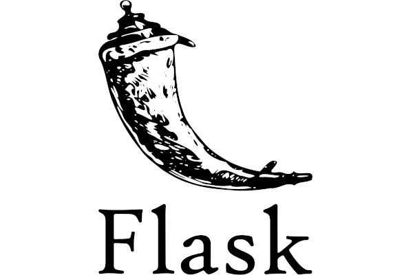

# NanoURL



A URL shortener written in Python.

## Developers

- Her Majesty Sumi [GitHub](https://github.com/ci-sumi) / [Linkedin](https://www.linkedin.com/in/sumi-tharayil-surendran-33ba69268/)
- Tomislav Dukez: [GitHub](https://github.com/tomdu3) / [Linkedin](https://www.linkedin.com/in/tomislav-dukez)

## Tech

- [UV](https://astral.sh/uv/) - A Rust based Python package and project management tool.
- [Flask](https://flask.palletsprojects.com/en/2.2.x/) - A lightweight web framework based on Python and used to build web applications and APIs.
- [PyShorteners](https://github.com/ellisonleao/pyshorteners) - Python library that bridges to various third party shortening services like TinyUrl,Bitly etc..

## Local Deployment

- **Windows**

1. Installation

```sh
irm https://astral.sh/uv/install.ps1 | iex
git clone https://github.com/ci-sumi/NanoURL.git
cd NanoURL
uv sync
# activate virtual environment
.venv\Scripts\activate
```

1. Run script

```sh
uv run main.py
```

Git tips from Tomi
```sh
git remote show origin
[-Scenario- git pull was pulling from origin/master
git push was pushing to origin/main]
git branch -u origin/main main

```


## References

- [Title 1](https://medium.com/@dieggo.filipe/uv-the-new-python-package-manager-you-need-to-know-492a147af74c)
- [Video 1](https://www.youtube.com/watch?v=AMdG7IjgSPM)
- [Video 2](https://youtu.be/5rTwOt9Qgik)
- [Flask Video](https://www.youtube.com/watch?v=mqhxxeeTbu0&list=PLzMcBGfZo4-n4vJJybUVV3Un_NFS5EOgX)
- [Flask Video 2](https://www.youtube.com/watch?v=45P3xQPaYxc)
