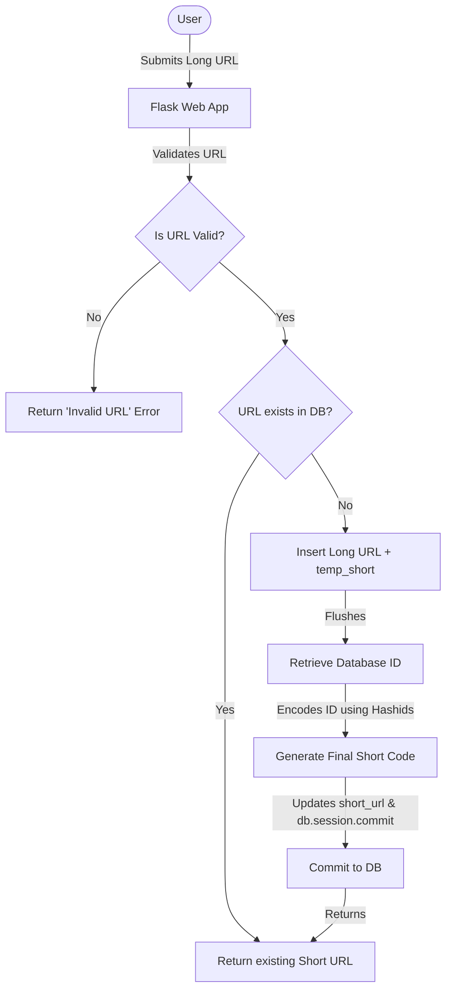
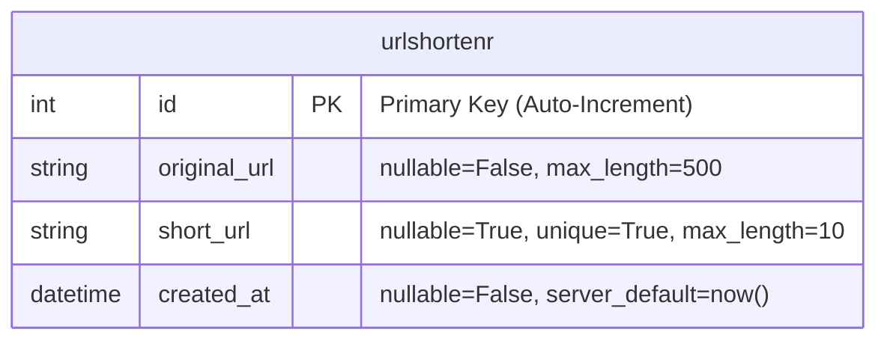

# NanoURL

## Project Description

**NanoURL** is a simple, lightweight, and self-hosted URL shortener web application. It takes long, complex URLs and converts them into short, unique, and easy-to-share links. The application is built using Python and Flask, storing URLs in SQLite locally and PostgreSQL in production, while using `hashids` with custom salting to safely obfuscate database primary keys into unique, clean short codes.
The project is successfully deployed on [Vercel](https://nano-url-nine.vercel.app/)


<!-- Flask Icon -->


## Table of Contents

- [Project Description](#project-description)
- [Features](#features)
- [How It Works](#how-it-works)
- [Database Schema](#database-schema)
- [Tech Stack & Tools](#tech-stack--tools)
- [Environment Variables](#environment-variables)
- [Local Deployment](#local-deployment)
- [Vercel Deployment](#vercel-deployment)
- [Bugs](#bugs)
- [References](#references)
- [Developers](#developers)
- [Acknowledgement](#acknowledgement)

## Features

- **URL Shortening**: Shorten long HTTP/HTTPS URLs.
- **Hashids Encoding**: Uses `hashids` to encode auto-incremented IDs to create short, unique URL codes.
- **Database Support**: Configured to run on SQLite locally and PostgreSQL in production (e.g., on Vercel).
- **Redirection**: Fast redirection to original URLs via short codes.
- **Copy to Clipboard**: Copy the shortened URL to the clipboard.

## How It Works

### Demo

<!-- TODO: add a link to the youtube video demoing the app, explaining the features, and the code -->

### Flowchart

This flowchart explains the flow when a user requests to shorten a URL:



## Database Schema

The application uses a single database table to map original URLs to their shortened counterparts:



## Tech Stack & Tools

- [UV](https://astral.sh/uv/) - A Rust-based Python package and project management tool.
- [Flask](https://flask.palletsprojects.com/en/2.2.x/) - A lightweight Python web framework.
- [Jinja2](https://jinja.palletsprojects.com/) - Modern and designer-friendly templating engine for Python, integrated into Flask.
- [Tailwind CSS](https://tailwindcss.com/) - A utility-first CSS framework for rapid UI styling.
- [SQLAlchemy](https://www.sqlalchemy.org/) - Database ORM for managing URL models.
- [Hashids](https://hashids.org/) - Generate short, unique hashes from numbers.
- [SQLite](https://www.sqlite.org/) - Lightweight SQL database engine used for local development.
- [PostgreSQL](https://www.postgresql.org/) - Powerful, open-source object-relational database system used in production.
- [Antigravity](https://antigravity.google/)-AI tool, I used Antigravity for deployment, README file creation, and diagram generation.

**How to install tailwind and use it with Flask**

```sh
npm install -D tailwindcss@3
npx tailwindcss init -p
static/src/input.css
/* static/input.css */
@tailwind base;
@tailwind components;
@tailwind utilities;
/*Make sure tailwind.config.js */
content: ["./templates/index.html"],
static/css/output.css
/* Buid Tailwind */
npx tailwindcss -i ./static/src/input.css -o ./static/css/output.css --watch
/* Link css in Flask HTML */
<link href="{{ url_for('static', filename='css/output.css') }}" rel="stylesheet">
```

## Environment Variables

Create a `.env` file in the root directory and configure:

```env
DATABASE_URI="sqlite:///site.db"   # For local development
HASHIDS_SALT="your-secret-salt"    # Used to obscure auto-incremented IDs
```

## Deployment

### Local Deployment

#### Windows

1. Installation

```sh
irm https://astral.sh/uv/install.ps1 | iex
git clone https://github.com/ci-sumi/NanoURL.git
cd NanoURL
uv sync

2. Run script
uv run main.py

```

#### Linux

- install `uv`

```sh
curl -LsSf https://astral.sh/uv/install.sh | bash
```

- install `NanoURL`

```sh
git clone https://github.com/ci-sumi/NanoURL.git
cd NanoURL
uv sync
uv run main.py
```

3. Open browser and go to [http://localhost:5000/](http://localhost:5000/)

## Vercel Deployment

1. **Prerequisites**
   - A Vercel Account.
   - An external PostgreSQL database (e.g., Supabase, Neon, or Vercel Postgres).
   - A configuration file `vercel.json` in the root (already exists).
   - A `requirements.txt` file (already exists).

2. **Setup Environment Variables on Vercel**
   Add the following environment variables in your Vercel Project Settings:
   - `DATABASE_URL`: Your production PostgreSQL connection string.
   - `HASHIDS_SALT`: A secret key/salt for encoding short URLs.

3. **Deploy using Vercel CLI**
   Install the Vercel CLI and run the deploy command:

   ```sh
   # Install Vercel CLI globally
   npm install -g vercel

   # Login to your Vercel account
   vercel login

   # Deploy the project
   vercel
   ```

   Follow the prompts to link and deploy your application.

4. **Deploy via GitHub (Recommended)**
   - Push your code to a GitHub repository.
   - Import the repository in your Vercel Dashboard.
   - Configure the environment variables in the settings and click **Deploy**. Vercel will automatically redeploy on every commit to `main`.

## Bugs

### 1. Git Branch Sync Issue

If `git pull` pulls from `origin/master` but `git push` pushes to `origin/main`, link them:

```sh
git remote show origin
git branch -u origin/main main
```

### 2. Git index.lock Issue

If you run into an index lock issue where a process was interrupted:

Solve it by running:

```sh
rm -f .git/index.lock
```

### 3. Solving a PostgreSQL Not Null Violation

While building a URL shortener using Python, Flask, and SQLAlchemy, I needed the database-generated id to encode the final short URL.
I called db.session.flush() to get the auto-incremented id. But PostgreSQL had a strict NOT NULL constraint on the short_url column:
#Fails

```py
submit_original_url = Urlshortenr(original_url=long_url)
db.session.add(submit_original_url)
db.session.flush()
#Fix
Generate a temporary random placeholder short URL to satisfy the constraint during flush, then overwrite it

temp_short = "".join(random.choices(string.ascii_letters + string.digits, k=10))
submit_original_url = Urlshortenr(original_url=long_url, short_url=temp_short)
db.session.add(submit_original_url)
db.session.flush() # ID is retrieved successfully!
```

## Encryption & Salting Notes

- **Hashing/Encoding**: Scrambling data beyond recognition.
- **Salting**: Adding random data (salt) to the input before hashing to increase security and prevent collisions.

## References

- [Video 1 UV - A Faster, All-in-One Package Manager to Replace Pip and Venv](https://www.youtube.com/watch?v=AMdG7IjgSPM)
- [Video 2 Switching to UV](https://youtu.be/5rTwOt9Qgik)
- [Video 3 Flask-How to Make Websites with Python](https://www.youtube.com/watch?v=mqhxxeeTbu0&list=PLzMcBGfZo4-n4vJJybUVV3Un_NFS5EOgX)
- [Video 4 Python Flask Tutorial](https://www.youtube.com/watch?v=45P3xQPaYxc) -[Codepen UI design](https://codepen.io/iamwillie/pen/bGVVeeW)
- [Video 5 Tailwind Crash Course ](https://youtu.be/6biMWgD6_JY)
- [ Video 6 How To Use Python On A Web Page With Jinja2](https://youtu.be/4yaG-jFfePc)
- [Python Using For Loop In Flask](https://www.geeksforgeeks.org/python/python-using-for-loop-in-flask/)
- [Salting](https://www.geeksforgeeks.org/computer-networks/implementing-salting/)
- [How to Make a URL Shortener with Flask and SQLite](https://www.digitalocean.com/community/tutorials/how-to-make-a-url-shortener-with-flask-and-sqlite)

## Developers

- Her Majesty Sumi [GitHub](https://github.com/ci-sumi) / [Linkedin](https://www.linkedin.com/in/sumi-tharayil-surendran-33ba69268/)
- Tomislav Dukez: [GitHub](https://github.com/tomdu3) / [Linkedin](https://www.linkedin.com/in/tomislav-dukez)

## Acknowledgement

My Friend, collaborator and mentor Tomislav Dukez [GitHub](https://github.com/tomdu3), [Linkedin](https://www.linkedin.com/in/tomislav-dukez/). This project would not have happend without your knowledge, guidence and motivation. I truly meant it Tomi.Thank you.
