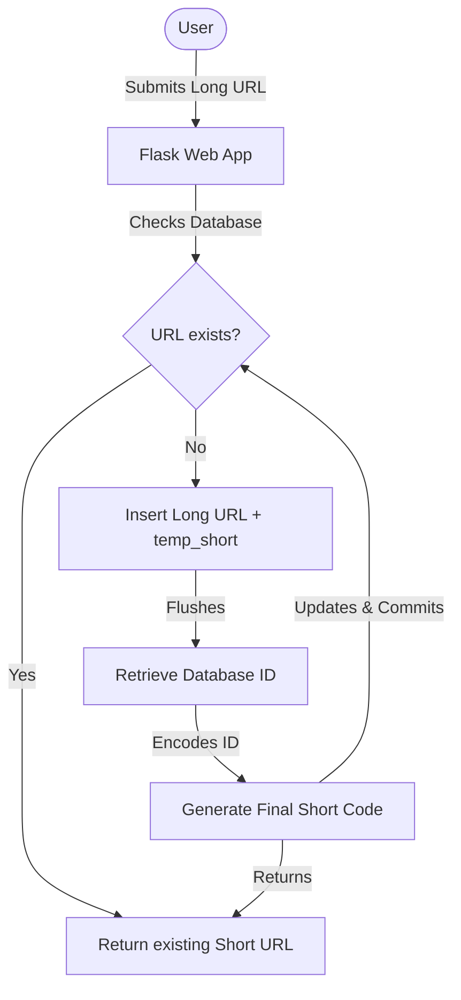

# NanoURL


A URL shortener written in Python.

## Table of Contents
- [Features](#features)
- [How It Works](#how-it-works)
- [Developers](#developers)
- [Tech Stack](#tech-stack)
- [Environment Variables](#environment-variables)
- [Local Deployment](#local-deployment)
- [Vercel Deployment](#vercel-deployment)
- [Troubleshooting & Git Tips](#troubleshooting--git-tips)
- [References](#references)
- [Acknowledgement ](#acknowledgement)


## Features
- **URL Shortening**: Shorten long HTTP/HTTPS URLs.
- **Hashids Encoding**: Uses `hashids` to encode auto-incremented IDs to create short, unique URL codes.
- **Database Support**: Configured to run on SQLite locally and PostgreSQL in production (e.g., on Vercel).
- **Redirection**: Fast redirection to original URLs via short codes.
- **Copy to Clipboard**: Copy the shortened URL to the clipboard.
## How It Works

This flowchart explains the flow when a user requests to shorten a URL:




## Developers

- Her Majesty Sumi [GitHub](https://github.com/ci-sumi) / [Linkedin](https://www.linkedin.com/in/sumi-tharayil-surendran-33ba69268/)
- Tomislav Dukez: [GitHub](https://github.com/tomdu3) / [Linkedin](https://www.linkedin.com/in/tomislav-dukez)

## Tech Stack

- [UV](https://astral.sh/uv/) - A Rust-based Python package and project management tool.
- [Flask](https://flask.palletsprojects.com/en/2.2.x/) - A lightweight Python web framework.
- [SQLAlchemy](https://www.sqlalchemy.org/) - Database ORM for managing URL models.
- [Hashids](https://hashids.org/) - Generate short, unique hashes from numbers.
- [PyShorteners](https://github.com/ellisonleao/pyshorteners) - Python library bridging to third-party shortening services.

## Environment Variables

Create a `.env` file in the root directory and configure:
```env
DATABASE_URI="sqlite:///site.db"   # For local development
HASHIDS_SALT="your-secret-salt"    # Used to obscure auto-incremented IDs
```

## Local Deployment

- **Windows**

1. Installation

```sh
irm https://astral.sh/uv/install.ps1 | iex
git clone https://github.com/ci-sumi/NanoURL.git
cd NanoURL
uv sync
# activate virtual environment
.venv\Scripts\activate
```

2. Run script

```sh
uv run main.py
```

## Vercel Deployment

1. **Prerequisites**
   - A Vercel Account.
   - An external PostgreSQL database (e.g., Supabase, Neon, or Vercel Postgres).
   - A configuration file `vercel.json` in the root (already exists).
   - A `requirements.txt` file (already exists).

2. **Setup Environment Variables on Vercel**
   Add the following environment variables in your Vercel Project Settings:
   - `DATABASE_URL`: Your production PostgreSQL connection string.
   - `HASHIDS_SALT`: A secret key/salt for encoding short URLs.

3. **Deploy using Vercel CLI**
   Install the Vercel CLI and run the deploy command:
   ```sh
   # Install Vercel CLI globally
   npm install -g vercel

   # Login to your Vercel account
   vercel login

   # Deploy the project
   vercel
   ```
   Follow the prompts to link and deploy your application.

4. **Deploy via GitHub (Recommended)**
   - Push your code to a GitHub repository.
   - Import the repository in your Vercel Dashboard.
   - Configure the environment variables in the settings and click **Deploy**. Vercel will automatically redeploy on every commit to `main`.

## Troubleshooting & Git Tips

### Git Branch Sync Issue
If `git pull` pulls from `origin/master` but `git push` pushes to `origin/main`, link them:
```sh
git remote show origin
git branch -u origin/main main
```

### Git index.lock Issue
If you run into an index lock issue where a process was interrupted:


Solve it by running:
```sh
rm -f .git/index.lock
```

### Encryption & Salting Notes
- **Hashing/Encoding**: Scrambling data beyond recognition.
- **Salting**: Adding random data (salt) to the input before hashing to increase security and prevent collisions.

## References

- [Title 1](https://medium.com/@dieggo.filipe/uv-the-new-python-package-manager-you-need-to-know-492a147af74c)
- [Video 1](https://www.youtube.com/watch?v=AMdG7IjgSPM)
- [Video 2](https://youtu.be/5rTwOt9Qgik)
- [Flask Video](https://www.youtube.com/watch?v=mqhxxeeTbu0&list=PLzMcBGfZo4-n4vJJybUVV3Un_NFS5EOgX)
- [Flask Video 2](https://www.youtube.com/watch?v=45P3xQPaYxc)
-[Codepen](https://codepen.io/iamwillie/pen/bGVVeeW)
## Acknowledgement 
My Friend,collabrator and mentor Tomislav Dukez [GitHub](https://github.com/tomdu3) and [Linkedin](https://www.linkedin.com/in/tomislav-dukez/).This project would not have happend without your knowledge, guidence and motivation.I truly meant it Tomi.Thank you.